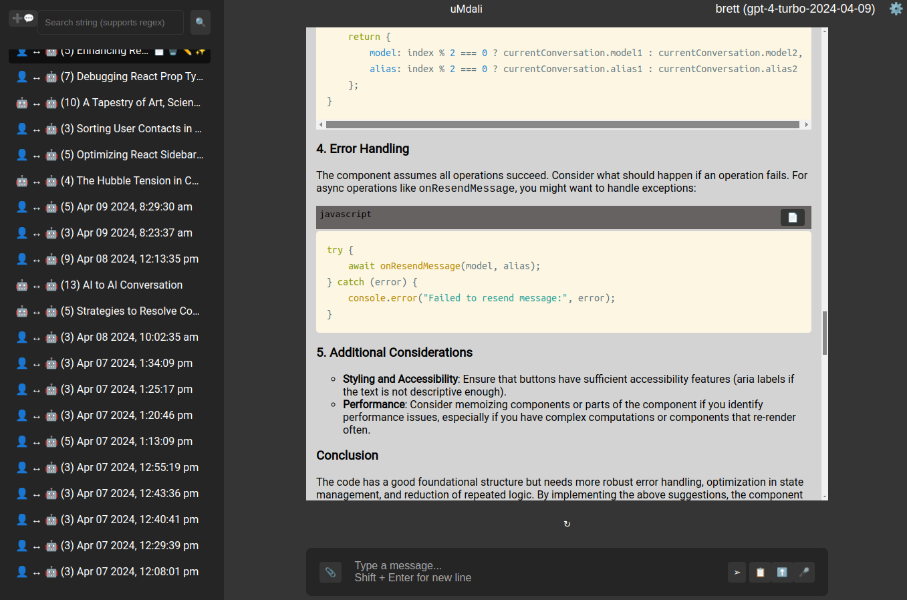

# uMdali
Pronounced "oom-DAH-lee"

**Enterprise LLM Chat Front End**

**For LLMs that have a REST API**



## Project Overview

### Introduction

Welcome to the repository of our innovative chat application, a cutting-edge platform designed to redefine the way we communicate with LLMs. This application stands as a testament to the power of AI-assisted development, with the majority of its codebase—over 95%—having been crafted by the advanced language model, ChatGPT.

### Development Journey

The creation of this application is a unique narrative of collaboration between human ingenuity and artificial intelligence. As the architect behind this project, my role extended beyond traditional coding. While ChatGPT laid down the structural foundation with its robust code generation capabilities, I embarked on an intensive journey of debugging and integration.

Given that my expertise was not originally rooted in React or Node.js, the development process presented a series of challenges. Bridging the gap between disparate segments of AI-generated code in unfamiliar territories was no small feat. It required patience, a willingness to learn, and an unwavering commitment to bringing this project to fruition.

### AI Contributions

In the pursuit of the ideal AI collaborator, I explored various models such as Bard, Claude, Gemini, and Minstral. Each of these models brought something unique to the table, yet they fell short of meeting the specific demands of this project. However, it is worth noting that Minstral Medium showcased a remarkable proficiency in JavaScript code generation, hinting at its potential for future contributions.

### Final Thoughts

This application is not just a product of code; it is a harmonious blend of AI innovation and human determination. It is a reminder that the future of software development is not a solitary path but a shared journey with artificial intelligence as our ally.

We invite you to delve into the code, explore the features, and join us in celebrating the new horizons that this chat application represents. Your feedback and contributions are not only welcomed but essential in shaping the continued evolution of this project.

# Getting Started with uMdali

**This is not an application to run models it is an application to talk to APIs exposed by models running locally or remotely.**

Our chat application is designed with flexibility in mind, catering to both enterprise-level deployment and individual local setups. Choose the deployment strategy that best suits your needs and follow the corresponding guide to get started:

- [For Enterprises: Deploying in Internal Containers](#for-enterprises-deploying-in-internal-containers)
- [For Local Use: Running with Docker](#for-local-development-running-with-docker)
- [For Local Use: Running with npm](#for-local-use-running-with-npm)
- [Frequently Asked Questions (FAQ)](#frequently-asked-questions-faq)

## For Enterprises: Deploying in Internal Containers

0. **For intranet use only**
    - This application does not have sufficient security to allow it to be exposed to the **internet**.
1. **Prerequisites**
    - Ensure you have a container orchestration system (e.g., Kubernetes) set up.
    - Verify that your internal registry is accessible.
    - The application requires access to a Mongo DB instance.

2. **Configuration**
    - Clone the repository to your internal system.
    - Customize the application configuration to align with your enterprise security and infrastructure policies.

3. **Building the Container Image**
    - Build the Docker image using the provided Dockerfile.
    - Tag and push the image to your internal container registry.

4. **Deployment**
    - Create deployment configurations for your orchestration system.
    - Set up necessary services, ingress controllers, and persistent storage according to your needs.
    - Deploy the application to your container orchestration system.

5. **Post-Deployment**
    - Verify the deployment and ensure all services are running as expected.
    - Perform any necessary post-deployment configurations.

6. **User Onboarding**
    - Provide documentation and training for end-users to get started with the application.

## For Local Development: Running with Docker

1. **Prerequisites**
    - Install Docker on your local machine.
    - You must have access to a Mongo DB. By default the `docker-compose` file will create a mongo container to use. You can edit the `docker-compose` file to use any Mongo DB instance.

2. **Getting the Application**
    - Clone the repository to your local system.
```
git clone https://github.com/brett-baudin-consulting/uMdali
```

3. **Running the Application**
    - Navigate to the project directory in your terminal.
    - Edit the `docker-compose.yml` file to suit your needs.
    - Run `docker-compose up` to build and start the application containers.

4. **Accessing the Application**
    - Open your web browser and navigate to `http://localhost:8080` or the Docker-provided IP.
    - The default configuration is to disable Auth. However you still need to login with any username and password. Password is ignored but must be there.

5. **Shutting Down**
    - Use `docker-compose down` to stop and remove the containers.

---

## For Local Use: Running with npm

### Step 1: Prerequisites

Before we begin, you'll need a couple of things:

- **Node.js and npm**: These are programming tools that let you run the application. You can download them from [the official Node.js website](https://nodejs.org/). Just choose the version that matches your operating system and follow the installation instructions.
- **MongoDB**: This is where all the data for the application is stored. You can sign up for a free MongoDB at [MongoDB Atlas](https://www.mongodb.com/cloud/atlas) or install it locally from [the MongoDB website](https://www.mongodb.com/try/download/community).

### Step 2: Getting the Application

- Clone the repository to your local system.
```
git clone https://github.com/brett-baudin-consulting/uMdali
```


**or**


Instead of cloning the whole repository, we'll download the latest stable version of the application. Here's how to do it:

- **Download the Latest Release**: Visit the 'Releases' section of the repository on GitHub. You can usually find it by appending `/releases` to the URL of the repository, like this: `https://github.com/brett-baudin-consulting/uMdali/releases`.
- **Choose the Latest Release**: Look for the release that is marked as 'Latest'. It should be at the top of the list.
- **Download the Source Code**: Under the latest release, you'll see links to download the source code, either as a ZIP or a TAR.GZ file. Click on the one you prefer and save it to your computer.
- **Extract the Files**: Once the download is complete, you'll need to extract the files from the archive. Most operating systems can do this by double-clicking on the downloaded file. Choose a location on your computer where you want to keep the application files.

Now you have the latest stable version of the application ready to be set up on your local machine!

### Step 3: Installation

Now let's set things up:

- **Navigate to the Project Directory**: In your terminal, use the `cd` command to move into the directory where you cloned the repository. It should look something like this:

  ```
  cd path/to/your-repo-name
  ```

- **Install Dependencies**: The application needs several other pieces of code to run properly, which we call 'dependencies'. Run these commands to install them:

  ```
  cd backend
  npm install
  cd ../frontend
  npm install
  ```

- **Environment Configuration**: The application needs to know about your MongoDB and other settings. Here's how to set that up:

  - Find the file named `env_sample.txt` in the `backend` directory.
  - Rename it to `.env` (this might be tricky if you're not used to working with hidden files, but you can usually just right-click and select 'Rename').
  - Open the `.env` file in a text editor and change the settings like:
    - your MongoDB URL
    - any API keys that you have for models you want to use
    - and other preferences.

### Step 4: Running the Application

You're almost there! Let's start the application:

- **Start the Server and Client**: Go back to your terminal and make sure you're in the project directory. Run this command to start the application:

in the backend directory
```
npm run server
```

in the frontend directory
```
npm run client
```

### Step 5: Accessing the Application

Now the application should be running on your computer:

- **Open Your Web Browser**: Any web browser will do (like Chrome, Firefox, or Safari).
- **Navigate to the Application**: In the address bar at the top, type `localhost:3000` and press Enter. You should see the application's login screen!
- **Log In**: Since the default setting is no actual security, you can enter any username and make up a password. Just be sure to type something in both fields.

### Step 6: Stopping the Application

When you're done and want to turn off the application:

- **Stop the Server and Client**: Go to your terminal where the application is running. Press `Ctrl+C` (or `Cmd+C` on a Mac). This stops the process and turns off the application.

---

# Running the Application in Visual Studio Code

Visual Studio Code (VS Code) is a popular, lightweight code editor that can also be used to develop and run applications. Here's how to get your application up and running inside of VS Code.

## For Local Development: Running with VS Code

### Prerequisites

- **Visual Studio Code**: Download and install VS Code from [the official website](https://code.visualstudio.com/).
- **Docker Extension for VS Code**: Install the Docker extension from the VS Code marketplace. This will make it easier to manage Docker containers and images from within the editor.
- **MongoDB**: As mentioned earlier, you can use MongoDB Atlas or install it locally.

### Setting Up the Application

1. **Clone the Repository**: Use the integrated terminal in VS Code (`Ctrl+``) to clone the repository to your local system:

```
git clone https://github.com/brett-baudin-consulting/uMdali
```

2. **Open the Project**: Open the folder containing the cloned repository in VS Code.

3. **Install Extensions**: It's recommended to install additional extensions like ESLint for linting and Prettier for code formatting to enhance your development experience.

### Running the Application

1. **Terminal**: Open the integrated terminal in VS Code.

2. **Navigate to the Backend**: Change directory to the `backend` folder and install npm packages:

```
cd backend
npm install
```

3. **Configure the .env file**: Run the backend with nodemon for automatic reloading:

in the backend directory
```
cp sample_env.txt .env
```
    - Open the `.env` file in a text editor and change the settings like:
    - your MongoDB URL
    - any API keys that you have for models you want to use
    - and other preferences.

4. **Start the Backend**: Run the backend with nodemon for automatic reloading:

```
   in the backend directory
   npm run server
```

5. **Open a New Terminal**: For the frontend, open a new terminal tab in VS Code.

6. **Navigate to the Frontend**: Change directory to the `frontend` folder and install npm packages:

```
cd frontend
npm install
```

7. **Start the Frontend**: Run the frontend development server:

in the backend directory
```
npm run client
```

### Accessing the Application

- The frontend should now be available at `http://localhost:3000` in your web browser.
- The backend API will be accessible at `http://localhost:8001` or the port you've configured.

### Debugging the Application

VS Code has powerful debugging tools that you can use to troubleshoot your application:

1. **Set Breakpoints**: Click to the left of the line numbers in your code to set breakpoints.
2. **Start Debugging**: Use the Debug View on the left side of VS Code and start a debugging session by selecting the appropriate configuration.
3. **Inspect Variables**: During a debugging session, use the debug console to inspect variables and step through your code.

### Stopping the Application

- To stop the application, go to the terminal where the server and client are running and press `Ctrl+C` to terminate the processes.

### Additional Tips

- **Use Version Control**: VS Code has integrated Git support. Use it to commit changes, manage branches, and collaborate with others.
- **Customize Settings**: Tailor your development environment to your needs by customizing settings. Access settings by pressing `Ctrl+,`.
- **Explore Extensions**: The VS Code marketplace has a wide range of extensions to improve your productivity, such as code snippets, advanced syntax highlighting, and more.

---

I hope this guide helps you get started with the application! If you run into any issues or have any questions, don't hesitate to ask for help. Good luck!

---

# Frequently Asked Questions (FAQ)

## General Questions

### Q: What is this chat frontend?
A: Our chat frontend is a user-friendly interface that allows users to interact with an LLM that has exposed via a REST API for use by this application.

### Q: Which LLMS are supported?
A: We currently support integration with

    - Open AI chat models including vision (Requires API key)
    - Mistral chat models (Requires API key)
    - Google Gemini chat models (Requires API key)
    - [Ollama](https://ollama.ai/). frontended models running locally.

### Q: I am using an LLM that has a REST API that is not on the list. Will I be able to access it? 
A: 

    - If it is compatible with with one of our supported APIs then you should 
    be able to just change the URL for say Open AI to point to it. You would 
    also need to manually add the models names to the Mongo DB.
    - You can make a feature request to have it added.
    - You can create your own implementation of MessageAPI in the server code. 

## Usage

### Q: Are chat conversations saved or logged?
A: Yes, conversations are saved within Mongo.

## Troubleshooting

### Q: The chat frontend isn't displaying properly, what should I do?
A: First just try refreshing the page. Clearing your browser cache or trying a different browser can also resolve display issues.

## Support

### Q: Where can I get help if I have an issue or question?
A: Opening an issue on our GitHub repository if you encounter a bug or have a feature request.

### Q: Can I suggest a new feature for the chat frontend?
A: Absolutely! We welcome feedback and suggestions. Please use the 'Feature Request' template on our GitHub repository to submit your idea. Our development team will review it and consider it for future updates.
