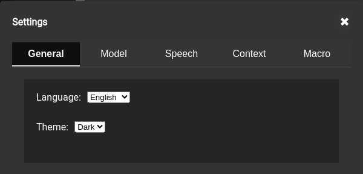
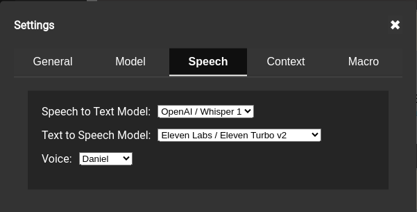
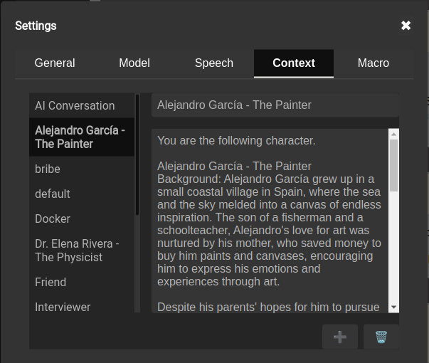
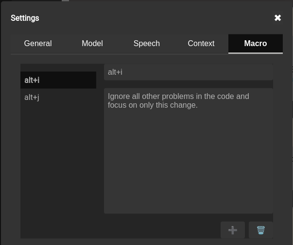

# uMdali
Pronounced "oom-DAH-lee"

**Enterprise LLM Chat Front End**

**For LLMs that have a REST API**









# Table of Contents
1. [Project Overview](#project-overview)
2. [Features](#features)
3. [Tutorials](#tutorials)
4. [Getting Started](#getting-started-with-umdali)
    * [For Enterprises: Deploying in Internal Containers](#for-enterprises-deploying-in-internal-containers)
    * [For Local Use: Running with Docker](#for-local-use-running-with-docker)
    * [For Local Use: Running with npm](#for-local-use-running-with-npm)
    * [For Local Development: Running with VS Code](#for-local-development-running-with-vs-code)
5. [Frequently Asked Questions (FAQ)](#frequently-asked-questions-faq)

# Project Overview

### Introduction

uMdali is a streamlined chat frontend application designed to provide seamless interactions with your REST-enabled language models (LLMs). It's particularly well-suited for enterprise environments. With a strong focus on adaptability, uMdali allows you to easily integrate the LLMs that best fit your needs.

###  Development Journey

Our development journey embodies a unique human-AI collaboration. The foundation of uMdali's code was largely generated by ChatGPT, demonstrating the impressive capabilities of AI-assisted development. We then intensively debugged, integrated, and refined the codebase within the React and Node.js frameworks. This process underscores the transformative potential of collaborating with AI in software development. 

### Looking Ahead

We believe uMdali represents a glimpse into the future of software creation,  a journey marked by shared innovation between humans and AI. We invite you to be a part of it – explore, contribute to the codebase, and help us drive this project forward. 

## Architecture

For a comprehensive understanding of uMdali's technology stack, design choices, and application structure, please consult the [High-Level Architecture](./docs/Highlevel-Architecture.md) document. This guide includes diagrams, explanations, and details about our frontend, backend, database, utilities, and development tools.

# Features

uMdali offers a broad range of features designed to enhance the user experience and provide a high level of adaptability for enterprise environments. Below is an overview of the key features available in uMdali:

- **AI and Human chats**
  - Industry standard AI and human chats

- **AI and AI chats**
  - Unique interface to allow AI to AI chats. Find out what AIs talk about with each other.

- **Speech to Text for Voice Input**
  - Incorporates speech-to-text functionality, allowing for voice input into chats.

- **Text to Speech for Voice Output**
  - Incorporates text-to-speech functionality, allowing for voice output in chats.

- **Multi-Lingual Support**
  - Supports multiple languages, enabling seamless interaction for users from various linguistic backgrounds.

- **Dynamic Text Resizing in Messages**
  - Dynamically resizes overly long text in messages to maintain readability and a clean interface.

- **Markdown Support for User Input**
  - Supports Markdown for user input, enabling message formatting with styles, links, lists, and more.

- **Conversation History Search**
  - Allows users to search through their conversation history for specific discussions, messages, or information.

- **Keyboard Macros for Text Injection**
  - Enables the use of keyboard macros for quick and efficient text injection into conversations.

- **Outbound Filtering for Message Content**
  - Supports outbound filtering to remove Personally Identifiable Information (PII), profanity, and other unwanted content.

- **Multi-User Support**
  - Accommodates multiple authenticated users.

- **Multiple Model Support**
  - Integrates with various language models (LLMs) that are REST API accessible, offering flexibility and choice.

- **Container-Based Architecture**
  - Leverages a container-based architecture for scalability, ease of deployment, and cross-platform compatibility.

- **Rate Limiting with Redis**
  - Implements rate limiting using Redis to manage the flow of requests and maintain performance.

- **Model-Created Conversation Titles**
  - Uses models to generate contextually relevant titles for conversations.

- **Enterprise-Grade with Individual Accessibility**
  - Designed for enterprise use but easily run by individuals on any platform, offering flexibility and accessibility.

- **Unlimited Context/System Prompts**
  - Supports an unlimited number of user context/system prompts for comprehensive interactions with language models.

# Tutorials
1. [AI to AI converstation tutorial.](https://twitter.com/BaudinBrett/status/1778781792348291360)

# Getting Started with uMdali

**This is not an application to run models it is an application to talk to APIs exposed by models running locally or remotely.**

Whether you're looking to deploy uMdali at an enterprise level or just want to tinker with it locally, we've got you covered. Choose your preferred deployment strategy below for a detailed step-by-step guide:

- [For Enterprises: Deploying in Internal Containers](#for-enterprises-deploying-in-internal-containers)
- [For Local Use: Running with Docker](#for-local-use-running-with-docker)
- [For Local Use: Running with npm](#for-local-use-running-with-npm)
- [For Local Development: Running with VS Code](#for-local-development-running-with-vs-code)

## For Enterprises: Deploying in Internal Containers


This section outlines the steps for deploying the uMdali application within an enterprise environment using internal containers. This deployment strategy is suited for organizations looking to leverage their existing container orchestration systems, such as Kubernetes.

### Prerequisites

Ensure your enterprise environment meets the following requirements:
- **Container Orchestration System**: A system like Kubernetes set up and configured for deploying containerized applications.
- **Internal Container Registry**: An accessible internal registry where custom container images can be stored and managed.
- **MongoDB Instance**: The application requires access to a MongoDB database. Ensure a MongoDB instance is available and accessible within your network.

### Deployment Process

1. **Repository Cloning**:
    - Clone the uMdali repository to an internal system that has access to your version control tools:
        ```bash
        git clone https://github.com/brett-baudin-consulting/uMdali
        ```

2. **Security and Configuration**:
    - Review and customize the application configuration to align with your enterprise security and infrastructure policies. Pay special attention to environment variables and application settings that might require adjustment.

3. **Building the Container Image**:
    - Build the Docker image using the provided Dockerfile within the cloned repository. This step prepares the uMdali application for deployment within your container orchestration system.
    - Tag and push the built image to your internal container registry. Ensure the tag used aligns with your tagging conventions and versioning strategy.

4. **Orchestration System Deployment**:
    - Create deployment configurations tailored to your container orchestration system. This typically involves defining services, deployments, and any necessary ingress controllers.
    - Incorporate configurations for persistent storage if required by the application or the MongoDB database.
    - Deploy the application to your container orchestration system following your standard deployment process.

5. **Post-Deployment Configuration**:
    - After deployment, verify the application is running as expected. This includes checking container logs, ensuring services are accessible, and performing initial application testing.
    - Perform any necessary post-deployment configurations, such as setting up monitoring, alerts, and scheduling regular backups.

6. **User Onboarding**:
    - Prepare documentation and resources to assist end-users in getting started with the uMdali application. This may include user guides, FAQs, and training sessions.
    - Ensure support channels are established for users to report issues or seek help during their initial interaction with the application.

### Important Considerations

- **Security**: Given that this application is intended for intranet use only, it does not include configurations for exposure to the internet. Review your deployment for potential security enhancements, especially if any components might be exposed beyond the intranet.
- **Maintenance and Updates**: Plan for regular maintenance and updates to the uMdali application and its dependencies. This includes monitoring for security patches and version updates to ensure the application remains secure and functional.

## For Local Use: Running with Docker

**If you have any issues getting either the prerequistes installed or the application itself installed please post in the Discussions or create a new Issue and we will do our best to help you out.**

This guide walks you through deploying the uMdali application using Docker, a popular containerization platform. Docker simplifies the setup process by packaging the application and its environment into containers. Follow these steps to get started:

### Prerequisites

Ensure you have Docker installed on your local machine. If not, download and install Docker Desktop from [the official Docker website](https://www.docker.com/products/docker-desktop). This application is compatible with Windows, macOS, and Linux operating systems.

### Getting the Application

1. **Clone the Repository**: Open a terminal and clone the uMdali repository to your local system with the following command:
    ```bash
    git clone https://github.com/brett-baudin-consulting/uMdali
    ```
    Alternatively, download the latest stable release from the GitHub repository's 'Releases' section.

2. **Navigate to the Project Directory**: Change your current directory to the cloned repository:
    ```bash
    cd uMdali
    ```

### Running the Application

1. **Customize the docker compose File**: Before running the application, you may need to edit the `docker-compose.yml` file to suit your specific needs. This file contains configuration settings for the Docker containers, including the MongoDB container.

2. **Build and Start the Containers**: Execute the following command in your terminal to build and start the application containers:
    ```bash
    docker compose up
    ```
    This command pulls the necessary Docker images, builds the application containers, and starts them. The process may take a few minutes, especially on the first run.

### Accessing the Application

- Once the containers are up and running, open your web browser and navigate to `http://localhost:8080` or the Docker-provided IP address.
- The default configuration disables authentication for simplicity. However, you are still required to log in with any username and password combination. The password is ignored but must be present.

### Shutting Down

- To stop and remove the application containers, return to the terminal and press `Ctrl+C` to stop the running process. Then, execute the following command:
    ```bash
    docker compose down
    ```
    This command stops the containers and removes them along with their networks.

---

This rewritten section provides a streamlined guide for deploying the uMdali application using Docker, ensuring clarity and consistency with the revised style.

## For Local Use: Running with npm

**If you have any issues getting either the prerequistes installed or the application itself installed please post in the Discussions or create a new Issue and we will do our best to help you out.**

This section guides you through the process of setting up and running the uMdali application using npm, which is a package manager for JavaScript. Follow these steps to get started:

### Prerequisites

Before beginning the setup, ensure you have the following installed on your system:
- **Node.js and npm**: Required to run the application. Download and install them from [the official Node.js website](https://nodejs.org/). Choose the version that is compatible with your operating system and follow the provided installation instructions.
- **MongoDB**: Used for data storage by the application. You can sign up for a free MongoDB account at [MongoDB Atlas](https://www.mongodb.com/cloud/atlas) or install MongoDB locally from [the MongoDB website](https://www.mongodb.com/try/download/community).

### Getting the Application

1. **Clone the Repository**: Open your terminal and run the following command to clone the uMdali repository to your local system:
    ```bash
    git clone https://github.com/brett-baudin-consulting/uMdali
    ```
    Alternatively, you can download the latest stable version of the application from the 'Releases' section of the GitHub repository.

2. **Navigate to the Project Directory**: Change into the directory where you cloned the repository:
    ```bash
    cd uMdali
    ```

### Installation

1. **Install Backend Dependencies**: Navigate to the backend directory and install the necessary npm packages:
    ```bash
    cd backend
    npm install
    ```
2. **Environment Configuration**: Set up your environment variables:
    - Locate the `env_sample.txt` file in the backend directory.
    - Rename it to `.env`.
    - Edit the `.env` file, replacing placeholder values with your actual MongoDB URL, API keys (if applicable), and other preferences.

3. **Install Frontend Dependencies**: Navigate to the frontend directory and repeat the installation process:
    ```bash
    cd ../frontend
    npm install
    ```

### Running the Application

1. **Start the Backend Server**: In the backend directory, start the server:
    ```bash
    npm run server
    ```
    This command runs the backend server, which listens for incoming requests from the frontend.

2. **Start the Frontend Client**: Open a new terminal window or tab, navigate to the frontend directory, and start the client:
    ```bash
    npm run client
    ```
    This command launches the frontend development server and opens the application in your default web browser.

### Accessing the Application

- With both the server and client running, the uMdali application should now be accessible at `http://localhost:3000` in your web browser.
- Log in using any username and password combination. Although the default configuration does not enforce authentication, entering credentials is necessary to proceed.

### Stopping the Application

- To stop the application, return to the terminals where the server and client are running. Press `Ctrl+C` in each terminal to terminate the processes.

## For Local Development: Running with VS Code

### Prerequisites

- **Visual Studio Code**: Download and install VS Code from [the official website](https://code.visualstudio.com/).
- **Docker Extension for VS Code**: (Optional) Install the Docker extension from the VS Code marketplace. This will make it easier to manage Docker containers and images from within the editor.
- **MongoDB**: As mentioned earlier, you can use MongoDB Atlas or install it locally.

### Setting Up the Application

1. **Clone the Repository**: Use the integrated terminal in VS Code (`Ctrl+``) to clone the repository to your local system:

```
git clone https://github.com/brett-baudin-consulting/uMdali
```

2. **Open the Project**: Open the folder containing the cloned repository in VS Code.

3. **Install Extensions**: It's recommended to install additional extensions like ESLint for linting and Prettier for code formatting to enhance your development experience.

### Running the Application

1. **Terminal**: Open the integrated terminal in VS Code.

2. **Navigate to the Backend**: Change directory to the `backend` folder and install npm packages:

    ```
    cd backend
    npm install
    ```

3. **Configure the .env file**: Run the backend with nodemon for automatic reloading:

    in the backend directory
    ```
    cp sample_env.txt .env
    ```
    Open the `.env` file in a text editor and change the settings like:
        - your MongoDB URL
        - any API keys that you have for models you want to use
        - and other preferences.

4. **Start the Backend**: Run the backend with nodemon for automatic reloading:

    in the backend directory
    ```
    npm run server
    ```

5. **Open a New Terminal**: For the frontend, open a new terminal tab in VS Code.

6. **Navigate to the Frontend**: Change directory to the `frontend` folder and install npm packages:

    ```
    cd frontend
    npm install
    ```

7. **Start the Frontend**: Run the frontend development server:

    in the backend directory
    ```
    npm run client
    ```

### Accessing the Application

- The frontend should now be available at `http://localhost:3000` in your web browser.
- The backend API will be accessible at `http://localhost:8001` or the port you've configured.

### Debugging the Application

VS Code has powerful debugging tools that you can use to troubleshoot your application:

- **Set Breakpoints**: Click to the left of the line numbers in your code to set breakpoints.
- **Start Debugging**: Use the Debug View on the left side of VS Code and start a debugging session by selecting the appropriate configuration.
- **Inspect Variables**: During a debugging session, use the debug console to inspect variables and step through your code.

### Stopping the Application

- To stop the application, go to the terminal where the server and client are running and press `Ctrl+C` to terminate the processes.

### Additional Tips

- **Use Version Control**: VS Code has integrated Git support. Use it to commit changes, manage branches, and collaborate with others.
- **Customize Settings**: Tailor your development environment to your needs by customizing settings. Access settings by pressing `Ctrl+,`.
- **Explore Extensions**: The VS Code marketplace has a wide range of extensions to improve your productivity, such as code snippets, advanced syntax highlighting, and more.

---

I hope this guide helps you get started with the application! If you run into any issues or have any questions, don't hesitate to ask for help. Good luck!

---

# Frequently Asked Questions (FAQ)

## General Questions

### Q: What is this chat frontend?
A: Our chat frontend is a user-friendly interface that allows users to interact with an LLM that is exposed via a REST API for use by this application.

### Q: Which LLMs are supported?
A: We currently support integration with:
- OpenAI chat models, including vision (requires an API key),
- Mistral chat models (requires an API key),
- Google Gemini chat models (requires an API key),
- [Ollama](https://ollama.ai/) frontended models running locally.

### Q: I am using an LLM that has a REST API that is not on the list. Will I be able to access it?
A: 
- If it is compatible with one of our supported APIs, then you should be able to just change, for example, the OpenAI URL to point to it. You would also need to manually add the model's names to the MongoDB.
- You can make a feature request to have it added.
- You can create your own implementation of `MessageAPI` in the server code.

### Q: I have models that are not on the list. How do I add them?
A: 
- You can update the file `backend/src/config/modelsConfig.json` and restart/rebuild the backend. It will perform an upsert on the database collection for models. Note: It will not delete any models. If you don't want an existing model to display, mark it as not available. Be sure to refresh your page to see the changes reflected.
- You can use [Compass](https://www.mongodb.com/products/tools/compass) to edit the Mongo collection **models**. Be sure to refresh your page to see the changes reflected.

## Usage

### Q: Are chat conversations saved or logged?
A: Yes, conversations are saved within MongoDB.

## Troubleshooting

### Q: The chat frontend isn't displaying properly, what should I do?
A: First, try refreshing the page. Clearing your browser cache or trying a different browser can also resolve display issues.

## Support

### Q: Where can I get help if I have an issue or question?
A: Open an issue on our GitHub repository if you encounter a bug or have a feature request.

### Q: Can I suggest a new feature for the chat frontend?
A: Absolutely! We welcome feedback and suggestions. Please use the 'Feature Request' template on our GitHub repository to submit your idea. Our development team will review it and consider it for future updates.
- **Dynamic Text Resizing in Messages**
  - Dynamically resizes overly long text in messages to maintain readability and a clean interface.

- **Markdown Support for User Input**
  - Supports Markdown for user input, enabling message formatting with styles, links, lists, and more.

- **Conversation History Search**
  - Allows users to search through their conversation history for specific discussions, messages, or information.

- **Keyboard Macros for Text Injection**
  - Enables the use of keyboard macros for quick and efficient text injection into conversations.

- **Outbound Filtering for Message Content**
  - Supports outbound filtering to remove Personally Identifiable Information (PII), profanity, and other unwanted content.

- **Multi-User Support**
  - Accommodates multiple authenticated users.

- **Multiple Model Support**
  - Integrates with various language models (LLMs) that are REST API accessible, offering flexibility and choice.

- **Container-Based Architecture**
  - Leverages a container-based architecture for scalability, ease of deployment, and cross-platform compatibility.

- **Rate Limiting with Redis**
  - Implements rate limiting using Redis to manage the flow of requests and maintain performance.

- **Model-Created Conversation Titles**
  - Uses models to generate contextually relevant titles for conversations.

- **Enterprise-Grade with Individual Accessibility**
  - Designed for enterprise use but easily run by individuals on any platform, offering flexibility and accessibility.

- **Unlimited Context/System Prompts**
  - Supports an unlimited number of user context/system prompts for comprehensive interactions with language models.

# Getting Started with uMdali

**This is not an application to run models it is an application to talk to APIs exposed by models running locally or remotely.**

Whether you're looking to deploy uMdali at an enterprise level or just want to tinker with it locally, we've got you covered. Choose your preferred deployment strategy below for a detailed step-by-step guide:

- [For Enterprises: Deploying in Internal Containers](#for-enterprises-deploying-in-internal-containers)
- [For Local Use: Running with Docker](#for-local-use-running-with-docker)
- [For Local Use: Running with npm](#for-local-use-running-with-npm)
- [For Local Development: Running with VS Code](#for-local-development-running-with-vs-code)

## For Enterprises: Deploying in Internal Containers


This section outlines the steps for deploying the uMdali application within an enterprise environment using internal containers. This deployment strategy is suited for organizations looking to leverage their existing container orchestration systems, such as Kubernetes.

### Prerequisites

Ensure your enterprise environment meets the following requirements:
- **Container Orchestration System**: A system like Kubernetes set up and configured for deploying containerized applications.
- **Internal Container Registry**: An accessible internal registry where custom container images can be stored and managed.
- **MongoDB Instance**: The application requires access to a MongoDB database. Ensure a MongoDB instance is available and accessible within your network.

### Deployment Process

1. **Repository Cloning**:
    - Clone the uMdali repository to an internal system that has access to your version control tools:
        ```bash
        git clone https://github.com/brett-baudin-consulting/uMdali
        ```

2. **Security and Configuration**:
    - Review and customize the application configuration to align with your enterprise security and infrastructure policies. Pay special attention to environment variables and application settings that might require adjustment.

3. **Building the Container Image**:
    - Build the Docker image using the provided Dockerfile within the cloned repository. This step prepares the uMdali application for deployment within your container orchestration system.
    - Tag and push the built image to your internal container registry. Ensure the tag used aligns with your tagging conventions and versioning strategy.

4. **Orchestration System Deployment**:
    - Create deployment configurations tailored to your container orchestration system. This typically involves defining services, deployments, and any necessary ingress controllers.
    - Incorporate configurations for persistent storage if required by the application or the MongoDB database.
    - Deploy the application to your container orchestration system following your standard deployment process.

5. **Post-Deployment Configuration**:
    - After deployment, verify the application is running as expected. This includes checking container logs, ensuring services are accessible, and performing initial application testing.
    - Perform any necessary post-deployment configurations, such as setting up monitoring, alerts, and scheduling regular backups.

6. **User Onboarding**:
    - Prepare documentation and resources to assist end-users in getting started with the uMdali application. This may include user guides, FAQs, and training sessions.
    - Ensure support channels are established for users to report issues or seek help during their initial interaction with the application.

### Important Considerations

- **Security**: Given that this application is intended for intranet use only, it does not include configurations for exposure to the internet. Review your deployment for potential security enhancements, especially if any components might be exposed beyond the intranet.
- **Maintenance and Updates**: Plan for regular maintenance and updates to the uMdali application and its dependencies. This includes monitoring for security patches and version updates to ensure the application remains secure and functional.

## For Local Use: Running with Docker

This guide walks you through deploying the uMdali application using Docker, a popular containerization platform. Docker simplifies the setup process by packaging the application and its environment into containers. Follow these steps to get started:

### Prerequisites

Ensure you have Docker installed on your local machine. If not, download and install Docker Desktop from [the official Docker website](https://www.docker.com/products/docker-desktop). This application is compatible with Windows, macOS, and Linux operating systems.

### Getting the Application

1. **Clone the Repository**: Open a terminal and clone the uMdali repository to your local system with the following command:
    ```bash
    git clone https://github.com/brett-baudin-consulting/uMdali
    ```
    Alternatively, download the latest stable release from the GitHub repository's 'Releases' section.

2. **Navigate to the Project Directory**: Change your current directory to the cloned repository:
    ```bash
    cd uMdali
    ```

### Running the Application

1. **Customize the docker compose File**: Before running the application, you may need to edit the `docker-compose.yml` file to suit your specific needs. This file contains configuration settings for the Docker containers, including the MongoDB container.

2. **Build and Start the Containers**: Execute the following command in your terminal to build and start the application containers:
    ```bash
    docker compose up
    ```
    This command pulls the necessary Docker images, builds the application containers, and starts them. The process may take a few minutes, especially on the first run.

### Accessing the Application

- Once the containers are up and running, open your web browser and navigate to `http://localhost:8080` or the Docker-provided IP address.
- The default configuration disables authentication for simplicity. However, you are still required to log in with any username and password combination. The password is ignored but must be present.

### Shutting Down

- To stop and remove the application containers, return to the terminal and press `Ctrl+C` to stop the running process. Then, execute the following command:
    ```bash
    docker compose down
    ```
    This command stops the containers and removes them along with their networks.

---

This rewritten section provides a streamlined guide for deploying the uMdali application using Docker, ensuring clarity and consistency with the revised style.

## For Local Use: Running with npm

This section guides you through the process of setting up and running the uMdali application using npm, which is a package manager for JavaScript. Follow these steps to get started:

### Prerequisites

Before beginning the setup, ensure you have the following installed on your system:
- **Node.js and npm**: Required to run the application. Download and install them from [the official Node.js website](https://nodejs.org/). Choose the version that is compatible with your operating system and follow the provided installation instructions.
- **MongoDB**: Used for data storage by the application. You can sign up for a free MongoDB account at [MongoDB Atlas](https://www.mongodb.com/cloud/atlas) or install MongoDB locally from [the MongoDB website](https://www.mongodb.com/try/download/community).

### Getting the Application

1. **Clone the Repository**: Open your terminal and run the following command to clone the uMdali repository to your local system:
    ```bash
    git clone https://github.com/brett-baudin-consulting/uMdali
    ```
    Alternatively, you can download the latest stable version of the application from the 'Releases' section of the GitHub repository.

2. **Navigate to the Project Directory**: Change into the directory where you cloned the repository:
    ```bash
    cd uMdali
    ```

### Installation

1. **Install Backend Dependencies**: Navigate to the backend directory and install the necessary npm packages:
    ```bash
    cd backend
    npm install
    ```
2. **Environment Configuration**: Set up your environment variables:
    - Locate the `env_sample.txt` file in the backend directory.
    - Rename it to `.env`.
    - Edit the `.env` file, replacing placeholder values with your actual MongoDB URL, API keys (if applicable), and other preferences.

3. **Install Frontend Dependencies**: Navigate to the frontend directory and repeat the installation process:
    ```bash
    cd ../frontend
    npm install
    ```

### Running the Application

1. **Start the Backend Server**: In the backend directory, start the server:
    ```bash
    npm run server
    ```
    This command runs the backend server, which listens for incoming requests from the frontend.

2. **Start the Frontend Client**: Open a new terminal window or tab, navigate to the frontend directory, and start the client:
    ```bash
    npm run client
    ```
    This command launches the frontend development server and opens the application in your default web browser.

### Accessing the Application

- With both the server and client running, the uMdali application should now be accessible at `http://localhost:3000` in your web browser.
- Log in using any username and password combination. Although the default configuration does not enforce authentication, entering credentials is necessary to proceed.

### Stopping the Application

- To stop the application, return to the terminals where the server and client are running. Press `Ctrl+C` in each terminal to terminate the processes.

## For Local Development: Running with VS Code

### Prerequisites

- **Visual Studio Code**: Download and install VS Code from [the official website](https://code.visualstudio.com/).
- **Docker Extension for VS Code**: (Optional) Install the Docker extension from the VS Code marketplace. This will make it easier to manage Docker containers and images from within the editor.
- **MongoDB**: As mentioned earlier, you can use MongoDB Atlas or install it locally.

### Setting Up the Application

1. **Clone the Repository**: Use the integrated terminal in VS Code (`Ctrl+``) to clone the repository to your local system:

```
git clone https://github.com/brett-baudin-consulting/uMdali
```

2. **Open the Project**: Open the folder containing the cloned repository in VS Code.

3. **Install Extensions**: It's recommended to install additional extensions like ESLint for linting and Prettier for code formatting to enhance your development experience.

### Running the Application

1. **Terminal**: Open the integrated terminal in VS Code.

2. **Navigate to the Backend**: Change directory to the `backend` folder and install npm packages:

    ```
    cd backend
    npm install
    ```

3. **Configure the .env file**: Run the backend with nodemon for automatic reloading:

    in the backend directory
    ```
    cp sample_env.txt .env
    ```
    Open the `.env` file in a text editor and change the settings like:
        - your MongoDB URL
        - any API keys that you have for models you want to use
        - and other preferences.

4. **Start the Backend**: Run the backend with nodemon for automatic reloading:

    in the backend directory
    ```
    npm run server
    ```

5. **Open a New Terminal**: For the frontend, open a new terminal tab in VS Code.

6. **Navigate to the Frontend**: Change directory to the `frontend` folder and install npm packages:

    ```
    cd frontend
    npm install
    ```

7. **Start the Frontend**: Run the frontend development server:

    in the backend directory
    ```
    npm run client
    ```

### Accessing the Application

- The frontend should now be available at `http://localhost:3000` in your web browser.
- The backend API will be accessible at `http://localhost:8001` or the port you've configured.

### Debugging the Application

VS Code has powerful debugging tools that you can use to troubleshoot your application:

- **Set Breakpoints**: Click to the left of the line numbers in your code to set breakpoints.
- **Start Debugging**: Use the Debug View on the left side of VS Code and start a debugging session by selecting the appropriate configuration.
- **Inspect Variables**: During a debugging session, use the debug console to inspect variables and step through your code.

### Stopping the Application

- To stop the application, go to the terminal where the server and client are running and press `Ctrl+C` to terminate the processes.

### Additional Tips

- **Use Version Control**: VS Code has integrated Git support. Use it to commit changes, manage branches, and collaborate with others.
- **Customize Settings**: Tailor your development environment to your needs by customizing settings. Access settings by pressing `Ctrl+,`.
- **Explore Extensions**: The VS Code marketplace has a wide range of extensions to improve your productivity, such as code snippets, advanced syntax highlighting, and more.

---

I hope this guide helps you get started with the application! If you run into any issues or have any questions, don't hesitate to ask for help. Good luck!

---

# Frequently Asked Questions (FAQ)

## General Questions

### Q: What is this chat frontend?
A: Our chat frontend is a user-friendly interface that allows users to interact with an LLM that is exposed via a REST API for use by this application.

### Q: Which LLMs are supported?
A: We currently support integration with:
- OpenAI chat models, including vision (requires an API key),
- Mistral chat models (requires an API key),
- Google Gemini chat models (requires an API key),
- [Ollama](https://ollama.ai/) frontended models running locally.

### Q: I am using an LLM that has a REST API that is not on the list. Will I be able to access it?
A: 
- If it is compatible with one of our supported APIs, then you should be able to just change, for example, the OpenAI URL to point to it. You would also need to manually add the model's names to the MongoDB.
- You can make a feature request to have it added.
- You can create your own implementation of `MessageAPI` in the server code.

### Q: I have models that are not on the list. How do I add them?
A: 
- You can update the file `backend/src/config/modelsConfig.json` and restart/rebuild the backend. It will perform an upsert on the database collection for models. Note: It will not delete any models. If you don't want an existing model to display, mark it as not available. Be sure to refresh your page to see the changes reflected.
- You can use [Compass](https://www.mongodb.com/products/tools/compass) to edit the Mongo collection **models**. Be sure to refresh your page to see the changes reflected.

## Usage

### Q: Are chat conversations saved or logged?
A: Yes, conversations are saved within MongoDB.

## Troubleshooting

### Q: The chat frontend isn't displaying properly, what should I do?
A: First, try refreshing the page. Clearing your browser cache or trying a different browser can also resolve display issues.

## Support

### Q: Where can I get help if I have an issue or question?
A: Open an issue on our GitHub repository if you encounter a bug or have a feature request.

### Q: Can I suggest a new feature for the chat frontend?
A: Absolutely! We welcome feedback and suggestions. Please use the 'Feature Request' template on our GitHub repository to submit your idea. Our development team will review it and consider it for future updates.