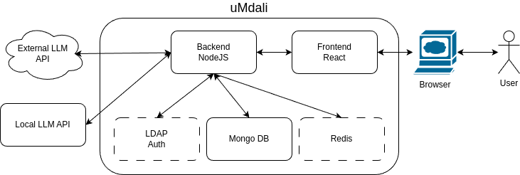

# High-Level Architecture Diagram

# Technology Stack

Our project leverages a modern, efficient, and scalable technology stack designed to deliver a robust chat application. Below is an overview of the core technologies, frameworks, and tools that constitute our project's foundation.

## Frontend

- **React**: We use React for building user interfaces with a focus on a responsive and dynamic user experience. React's component-based approach enables us to create reusable UI components.

- **CSS/SASS**: For styling, we use CSS with an option for SASS pre-processing to allow variables, nested rules, mixins, and more, enabling more maintainable stylesheets.

## Backend

- **Node.js**: Our server-side logic is built on Node.js, allowing us to write high-performance, scalable network applications using JavaScript.

- **Express.js**: We use Express.js, a minimal and flexible Node.js web application framework, to build our API endpoints. It provides a robust set of features for web and mobile applications.

- **LDAP Integration (Optional)**: To support optional authentication mechanisms, our application is capable of integrating with LDAP (Lightweight Directory Access Protocol) providers. This allows enterprises to authenticate users against their existing directory stores, providing a seamless and secure way to manage access to the chat application.

### Core Backend Framework:
- **Express**: A web application framework for Node.js, designed for building web applications and APIs.

### Database and ORM:
- **Mongoose**: An Object Data Modeling (ODM) library for MongoDB and Node.js. It manages relationships between data, provides schema validation, and is used to translate between objects in code and the representation of those objects in MongoDB.

### Authentication and Security:
- **Passport**: Middleware for Node.js that simplifies the process of handling authentication in Express applications. It can be unobtrusively dropped into any Express-based web application.
- **Passport-ldapauth**: A Passport strategy for authenticating against an LDAP server. It integrates with your LDAP authentication setup.
- **Profanity-util**: Utility for detecting and filtering profanity in your application, which might be crucial for maintaining the quality of user-generated content.
- **Redact-pii**: Library for redacting personally identifiable information (PII) from text, which is important for privacy and compliance.

### File Handling and Image Processing:
- **Multer**: Middleware for handling `multipart/form-data`, primarily used for uploading files.
- **Sharp**: A high-performance Node.js module to convert large images in common formats to smaller, web-friendly JPEG, PNG, WebP, AVIF, and TIFF images of varying dimensions.

### Utility Libraries:
- **Axios**: A promise-based HTTP client for the browser and Node.js. Useful for making HTTP requests to fetch or save data. 
- **Dotenv**: Loads environment variables from a `.env` file into `process.env`, providing a convenient way to configure your development environment.
- **Joi**: A powerful schema description language and data validator for JavaScript.
- **Jsonata**: A lightweight query and transformation language for JSON data.
- **Node-fetch**: A light-weight module that brings the `fetch` API to Node.js, making it easier to make web requests and handle responses.
- **Underscore**: A utility library providing useful functional programming helpers without extending any built-in objects.

### Logging:
- **Winston**: A multi-transport async logging library for Node.js. Designed to be a simple and universal logging library with support for multiple transports.

### Development Tools:
- **Nodemon**: A utility that monitors for any changes in your source and automatically restarts your server, making development more efficient.
- **Concurrently**: A utility that runs multiple commands concurrently. It's used here to run both the backend server and the frontend development server simultaneously for easier local development.
- **@babel/preset-react**: Babel preset for all React plugins, used for compiling JSX and other ES6+ features for browser compatibility.

## Database

- **MongoDB**: As our primary database, we use MongoDB, a NoSQL database, for its flexibility and scalability in handling large volumes of data and its powerful query capabilities.

## Containerization

- **Docker**: To ensure consistency across different development and deployment environments, we use Docker. Docker containers wrap up software with all its dependencies, making the application easy to run on any system that supports Docker.

- **Docker Compose**: For managing multi-container Docker applications, Docker Compose is used. It allows us to define and run multi-container Docker applications with ease.

## Development Tools

- **Git**: For version control, we use Git, allowing multiple developers to work together on the project efficiently.

- **npm/Yarn**: As our package manager, we use npm to manage the project's dependencies.

- **ESLint/Prettier**: To ensure code quality and consistency, ESLint is used for identifying and reporting on patterns in JavaScript, and Prettier for code formatting.

### Core UI Framework:
- **React**: The foundational UI library for building the frontend. It enables the creation of a dynamic and responsive user interface with a component-based architecture.
- **React-DOM**: Provides DOM-specific methods that can be used at the top level of a web app to enable efficient management of DOM elements.

### Internationalization and Localization:
- **i18next**: A powerful internationalization framework for JavaScript, allowing your application to support multiple languages.
- **i18next-browser-languagedetector**: Detects the user's language preferences directly from the browser settings.
- **i18next-fs-backend**: Enables loading of i18next translation resources from the file system, useful in certain build processes or server-side rendering contexts.
- **react-i18next**: Integrates i18next with React, providing hooks and components for translating your application.

### Styling and Layout:
- **Sass**: A preprocessor scripting language that is interpreted or compiled into Cascading Style Sheets (CSS). It offers more structured and maintainable CSS.
- **React-spinners**: A collection of loading spinner components for React, useful for indicating that part of the application is loading or processing.
- **Prop-types**: Runtime type checking for React props and similar objects, helping in the development process by ensuring you're passing the right data through your components.

### Markdown and Syntax Highlighting:
- **React-markdown**: Renders Markdown as React components. This is particularly useful for content-heavy applications that leverage Markdown for content management.
- **Highlight.js**: A syntax highlighter written in JavaScript. It's used in web projects to display code in a readable and highlighted format.
- **React-syntax-highlighter**: A React component for syntax highlighting using Highlight.js, integrating code highlighting functionality into React applications.
- **Remark-gfm**: A plugin to support GitHub Flavored Markdown (GFM) in your Markdown processing, enabling additional Markdown features like tables, footnotes, and strikethrough.

### Utilities and Helpers:
- **Moment**: A library for parsing, validating, manipulating, and displaying dates and times in JavaScript. Useful for handling all sorts of date/time formatting and manipulation.
- **UUID**: For the generation of RFC4122 UUIDs, useful in React applications for key generation, temporary IDs, or any other case where unique identifiers are required.
- **React-copy-to-clipboard**: Provides a React component and hook to utilize the browser's copy-to-clipboard functionality, enhancing user experience by simplifying the copy action.
- **React-textarea-autosize**: A React component that automatically adjusts textarea height to fit content, improving the user interface for dynamic text input.
- **Web-vitals**: A library for measuring all the Web Vitals metrics on real users, in a field.

### Development Tools:
- **React-scripts**: A set of scripts from the create-react-app boilerplate to help with the development process, including starting a development server, building the app, and running tests.
- **@testing-library/react**: Provides light utility functions on top of React-DOM and React-DOM/test-utils, enabling you to work more directly with DOM nodes.

### Code Quality and Formatting:
- **eslintConfig**: Extends configurations for ESLint, specifically tailored for React applications and Jest testing framework, ensuring code quality and consistency across the development team.

This technology stack represents our current choices for developing a highly efficient, scalable, and maintainable chat application. As the project evolves, we remain open to integrating new technologies that align with our goals and contribute to the project's success.